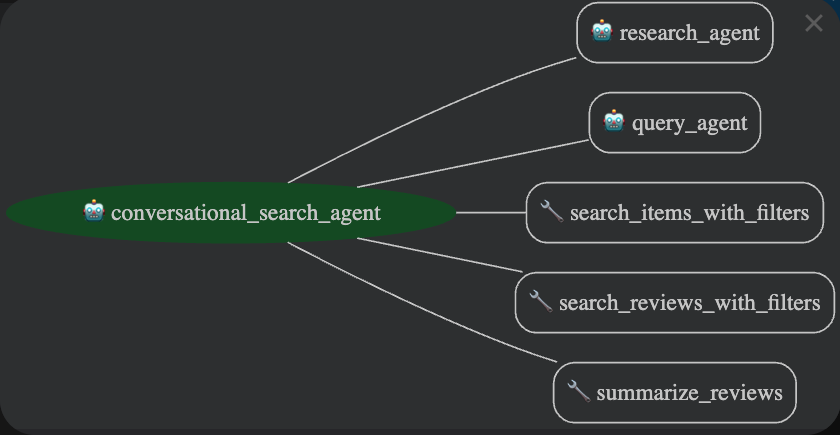

# Conversational Shopping Assistant

This project implements a conversational shopping assistant using Google's Generative AI Development Kit (ADK) and Vertex AI Search. The assistant helps users find products, get recommendations, and summarize reviews in a conversational manner, leveraging data from the Amazon Reviews 2023 dataset. 

Read more about this project in our [blog post](https://medium.com/@suyash.pawar612/beyond-the-search-bar-building-a-conversational-shopping-assistant-with-google-adk-f91be1566e2c)



## Dataset

This project uses the [Amazon Reviews 2023 dataset](https://amazon-reviews-2023.github.io/), a large-scale collection of Amazon product reviews and metadata. We specifically use the "Amazon Fashion" category, which includes product metadata and reviews.

## Data Ingestion

The data ingestion process is detailed in the Jupyter Notebook located at `data_ingestion/load_amz_fashion_data_BQ.ipynb`. This notebook was run in a Vertex AI Workbench notebook. The notebook performs the following steps:

1.  **Downloads Data:** It uses the `datasets` library to download the `raw_review_Amazon_Fashion` and `raw_meta_Amazon_Fashion` datasets.
2.  **Processes Data:** The notebook processes and cleans the data.
3.  **Loads to BigQuery:** The processed data is loaded into two BigQuery tables: `amazon_fashion_item_metadata` and `amazon_fashion_reviews_metadata`.

## Vertex AI Search Data Stores

The BigQuery tables are then used to create two Vertex AI Search data stores:

*   **Item data store:** Created from the `amazon_fashion_item_metadata` table, this data store holds product information.
*   **Review data store:** Created from the `amazon_fashion_reviews_metadata` table, this data store holds product reviews.

These data stores enable powerful semantic search capabilities over the product and review data, forming the backbone of the conversational assistant's ability to answer user queries accurately.

## Creating a Vertex AI Search Data Store

To create a Vertex AI Search data store, you can follow these general steps in the Google Cloud console, as detailed in the [official documentation](https://docs.cloud.google.com/generative-ai-app-builder/docs/create-data-store-es#bigquery)

## Features

- **Conversational Search:** Understands natural language queries and engages in a dialogue to refine search results using Vertex AI Search over the item and review data stores.
- **Gift Recommendations:** Provides gift ideas based on user descriptions.
- **Conditional Search:** Handles complex queries with filters and sorting conditions.
- **Review Summarization:** Summarizes product reviews to highlight pros and cons.
- **NL2SQL capability:** Queries a BigQuery database for complex and analytical questions.
- **Extensible Agent Architecture:** Uses a main agent and other agents as tools for specialized tasks.

## Getting Started

### Prerequisites

- Python 3.10 or higher
- Google Cloud SDK installed and configured
- Access to a Google Cloud project with the following APIs enabled:
    - Vertex AI API
    - Discovery Engine API
    - BigQuery API

### Installation

1.  **Clone the repository:**
    ```bash
    git clone https://github.com/ai-suyash/conversational-ai-shopping-assistant.git
    cd conversational-ai-shopping-assistant
    ```

2.  **Create a virtual environment:**
    ```bash
    python -m venv .venv
    source .venv/bin/activate
    ```

3.  **Install the dependencies:**
    ```bash
    pip install -r requirements.txt
    ```

4.  **Set up environment variables:**
    Create a `.env` file in the root directory and add the following:
    ```
    GOOGLE_GENAI_USE_VERTEXAI=TRUE
    GOOGLE_CLOUD_PROJECT="your-gcp-project-id"
    GOOGLE_CLOUD_LOCATION="your-gcp-location" # e.g., global, us, eu
    ITEM_DATA_STORE_ID="your-item-data-store-id"
    REVIEW_DATA_STORE_ID="your-review-data-store-id"
    BQ_DATA_PROJECT_ID="your-bigquery-data-project-id"
    BQ_DATASET_ID="your-bigquery-dataset-id"
    ```
5. **Run the agent for local testing:**
    ```bash
    adk web
    ```
### Usage

The main application logic is in `conversational_shopping_assistant/agent.py`. This file defines the main agent and orchestrates the other agents and tools. You can run this as part of a larger application, for example, a FastAPI web server.


## Project Structure

```
.
├── conversational_shopping_assistant
│   ├── sub_agents
│   │   ├── bigquery
│   │   │   ├── __init__.py
│   │   │   ├── agent.py
│   │   │   └── prompt.py
│   │   └── research
│   │       ├── __init__.py
│   │       ├── agent.py
│   │       └── prompt.py
│   ├── __init__.py
│   ├── agent.py
│   ├── prompt.py
│   └── tools.py
├── data_ingestion
│   └── load_amz_fashion_data_BQ.ipynb
├── assets
├── .env
├── README.md
└── requirements.txt
```

## Agent Tools

### Research Agent

The research agent is used as a tool to generate search queries for gift recommendations. It uses Google Search to research what people are buying for a specific intent and returns a list of search queries.

-   **Model:** `gemini-2.5-flash`
-   **Tools:** `google_search`

### BigQuery Agent

The BigQuery agent is used as a tool to answer questions about data stored in BigQuery. It can write and execute SQL queries to retrieve information from the database.

-   **Model:** `gemini-2.5-flash`
-   **Tools:** `execute_sql`

## Tools

The main agent uses the following tools to interact with the e-commerce site and its data:

-   `search_items_with_filters`: Searches for items in the Discovery Engine item metadata datastore with filters for price, rating, and more.
-   `search_reviews_with_filters`: Searches for reviews in the Discovery Engine reviews metadata datastore with filters for rating and helpful votes.
-   `summarize_reviews`: Summarizes a list of product reviews using the `gemini-2.5-flash` model.

## Sample Scenarios

Here are some scenarios that highlight the different capabilities of the agent:

**Scenario 1: Planning for a Vacation**
This scenario showcases the ability to search for multiple items with specific attributes suitable for a trip.
*   **User:** "I'm going on a beach vacation next month and need some new clothes. Can you help me find a swimsuit and a pair of sandals for under $50 each?"

**Scenario 2: Making an Informed Purchase**
This scenario highlights the agent's ability to not just find a product, but to also provide a summary of its reviews, helping the user make a better decision.
*   **User:** "I'm looking for a new pair of running shoes. Can you find me a highly-rated pair and then summarize the reviews for me?"

**Scenario 3: Finding the Perfect Gift**
This scenario demonstrates the agent's ability to help a user who doesn't know what to buy, by using the research tool to get ideas.
*   **User:** "It's my dad's birthday next week and I have no idea what to get him. He's into hiking and outdoors. Can you give me some gift ideas?"

**Scenario 4: Investigating Product Quality**
This scenario is for a user who is very particular about quality and wants to see detailed feedback before buying.
*   **User:** "I want to buy a new winter coat, but I'm worried about the quality. Can you show me only the reviews from people who gave it a 1 or 2-star rating, so I can see the potential problems?"

**Scenario 5: Budget-Conscious Shopping**
This scenario is for a user who is looking for the best deals and wants to find items within a specific budget.
*   **User:** "I need a new dress for a wedding, but I'm on a tight budget. Can you show me all dresses that cost less than $75?"

**Scenario 6: The Specific Shopper**
This scenario is for a user who knows exactly what they want in terms of quality, popularity, and price, using multiple filters at once.
*   **User:** "I'm looking for a high-quality, popular backpack for my daily commute. It needs to be under $150, have an average rating of at least 4.5 stars, and have been reviewed by at least 500 people."
